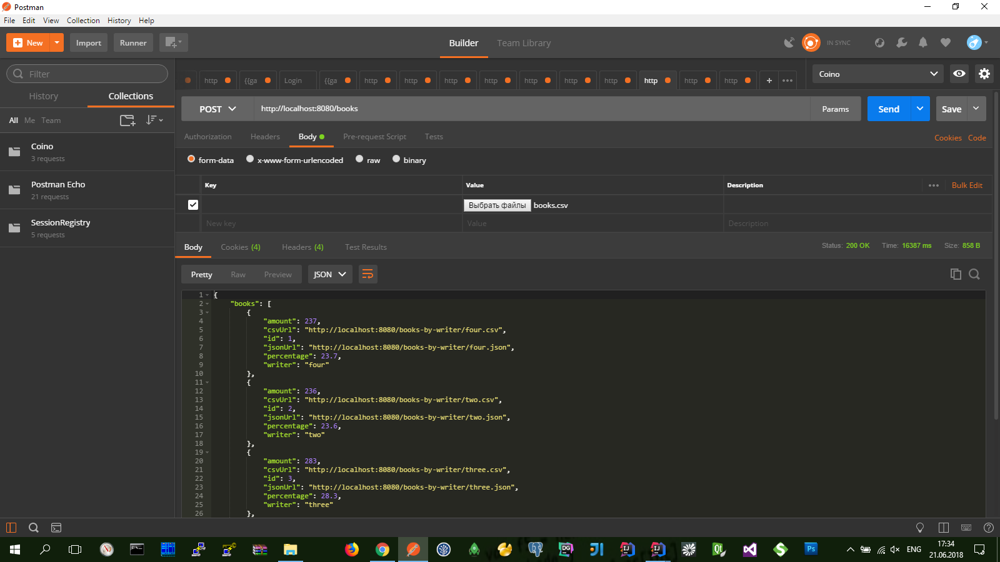

Akka Reactive Streams for Java
------------------------------

В основе приложения разработано 2-е актор-модели (чтобы на примерах продемонстрировать работу модели акторов).

Обрабатка распределенной модели акторов настроена через кластеры (чтобы увеличить производительность в количестве процессов). 

В качестве псевдо-репозитория использовал 'ConcurrentHashMap' ('ConcurrentSkipListMap').

1. Модель для сценария выгрузки даных из CSV-файла и сортировка их в различные файлы.
   Такую модель акторов описывает граф из метода ActorModelHelper.doUploadGraph
   В этот момент:
   - CSV-файл выгружается из веб энд-поинта 'http://localhost:8080/books';
   - данные из CSV-файла сортируются по признаку значению первой колонки;
   - отсортированые данные выгружаются в отдельные CSV-файлы на дисковую систему;
   - и в репозиторий статистики (CsvReportRepository.java) добавляется соответствующая запись; 
   - после этого из репозитория статистики можно получить инфорацию выполненую по обработке данных (здесь: общее количество, что и куда попало, отностительный процент, сформированные ссылки на CSV/JSON ресурсы);
2. Модель для сценария получения статистики по кадому из загруженных файлов (в JSON|CSV формате);
   Такую модель акторов описывает граф из метода ActorModelHelper.doDownloadGraph
   В этот момент:
   - (ожидается что до этого этапа уже предварительно получены ссылки на CSV/JSON ресурсы);
   - данные загружаются из CSV-файла на дисковой системе;
   - полученные данные добавляются в репозиторий (BookRepository.java);
   - после этого данные достаем уже из репозитория;

Актор модели реализованы с помощью Akka Stream.

В момент выгрузки данных из веб энд-поинта модель акторов в последовательном порядке построчно читает данные из CSV-файла, анализирует их и соответственно добавляет их в репозиторий и сохраняет отдельным CSV-файлом на файловой системе.

В момент загрузки данных из файловой системы модель акторов полностью вычитывает все содержимое CSV-файла и только потом добавляет их соответственно в репозиторий.
Только после этого клиент может получить сформированные данные (JSON) пакетом.
Для загрузки отсортированного бинарного файла - данные вытягиваются непосредственно из файловой системы.

Приложение может работать как:

- Веб приложение;
  Для этого при запуске приложения нужно передать агрументы **_--run web_**

POST
http://< HOST >/books
// энд-поинт для выгрузки данных из CSV-файла
`http://localhost:8080/books`

GET
http://< HOST >/books.json
// энд-поинт для получения общей статистики по обработке данных
`http://localhost:8080/books.json`

GET
http://< HOST >/books-by-writer/<PARAM>.json
// энд-поинт для получения статистки отсортированных CSV-файлов в JSON-формате
`http://localhost:8080/books-by-writer/one.json`

GET
http://< HOST >/books-by-writer/<PARAM>.csv
// энд-поинт для загрузки отсортированных CSV-файлов в бинарной форме
`http://localhost:8080/books-by-writer/one.csv`

- Консольное приложение.
  Для этого при запуске приложения нужно передать агрументы **_--run console --books-by-writer one --sort number_** (**_--run console --books-by-writer_**)
  В параметрах можно указать какой файл искать (без расширения), и необходимость сортировки по колонке (опционально) 
  Консольный модуль печатает отсортированую табличку в консоле

 

Приложение собирает в JAR через команду **_gradle clean buildJar_**

http://localhost:8080/books

Ресурсы
-------

* http://ac2epsilon.github.io/TRANS/SCALA/AkkaStreams.html
* ( https://github.com/akka/akka-http/blob/master/docs/src/test/java/docs/http/javadsl/HttpClientExampleDocTest.java )
