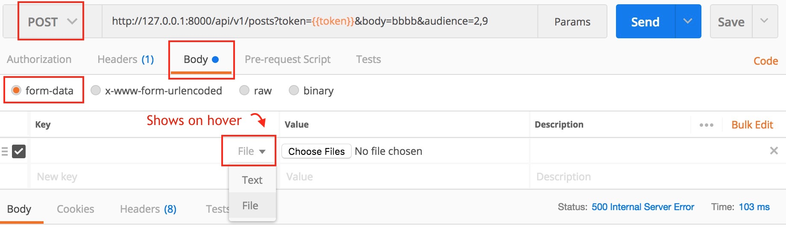
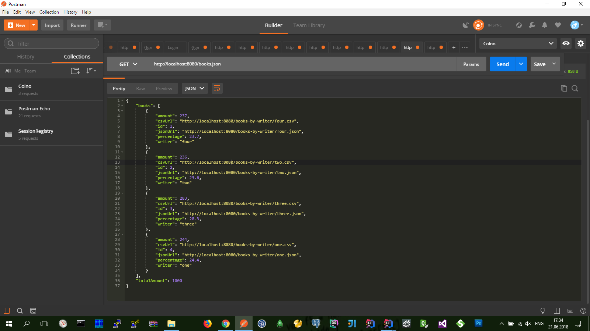
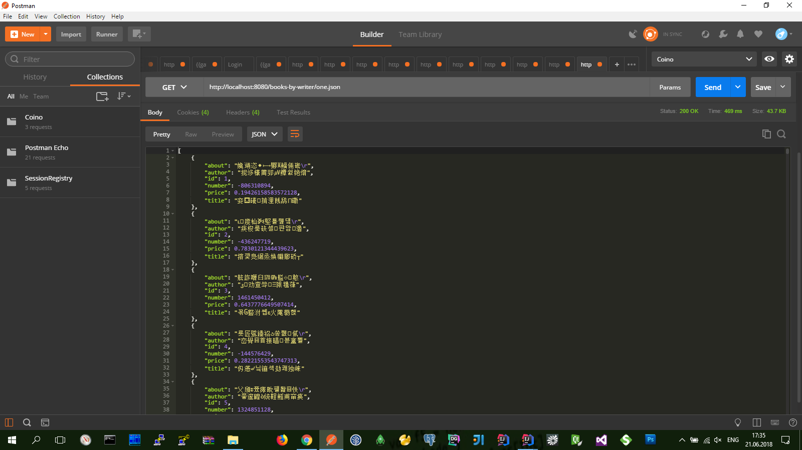
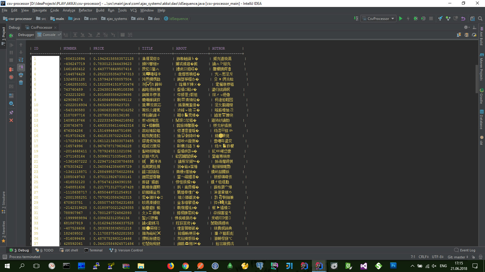

* `git clone https://github.com/JobTest/csv-processor.git`
* `cd csv-processor`
* `git chechout scala`
* `git push`

Модель акторов
--------------

Модель акторов представляет собой математическую модель параллельных вычислений:
- понятие «актор» как универсальный примитив параллельного численного расчёта: 
в ответ на получаемые сообщения актор может принимать локальные решения, создавать новые акторы, посылать свои сообщения, а также устанавливать, как следует реагировать на последующие сообщения.

Актор  —  примитивная единица, получающая сообщения и делающая примитивные вычисления основанные на этих сообщениях. 
Акторы изолированы друг от друга и имеют внутренее состояние которое не может быть изменено извне.

Akka — это самостоятельный инструмент. Ему не нужен сервер приложений, достаточно JVM и Java SE.
С помощью Akka можно объединить несколько JVM в кластер.
Akka предлагает модель актеров вместо объектно-ориентированной, которая считается распараллеленной по умолчанию.

    Актер — это вычислительная единица. В ответ на сообщение, которое он получил, актер может:
    — отправить определенное количество сообщений другим актерам;
    — создать определенное количество новых актеров;
    — определить поведение для обработки следующего сообщения, которое он получит.

        (Используя модель актеров, вы думаете об актерах вместо объектов и потоков. Можно иметь намного больше актеров, чем потоков)
        Актеры инкапсулируют состояние и поведение и общаются исключительно посредством обмена сообщениями. 
        Сообщения, полученные актером, ложатся в его почтовый ящик. 
        Актеров лучше рассматривать как людей. 
        Моделируя решение с моделью актеров, представьте группу людей, которым вы назначаете подзадачи. 
        Подзадачи — это результат деления одной большой задачи на мелкие куски, которые делегируются актерам для выполнения.

Для быстрого старта нужно знать о нескольких классах из пакета akka.actor. Это:
— ActorSystem — класс имплементирующий систему актеров;
— UntypedActor — класс, который нужно унаследовать для создания класса актера и переопределить метод onReceive для обработки входящих сообщений данным актером;
— ActorRef — класс, инкапсулирующий ссылку на актер. Он же используется для отправки сообщений актеру.

Используя эти классы:
— вызовите ActorSystem.create()для создания системы актеров и получения объекта ActorSystem;
— вызовите ActorSystem::actorOf() для создания экземпляра актера и получения его ActorRef;
— используйте ActorRef::tell() для отправки сообщений актеру.

Akka Reactive Streams for Java
------------------------------

В основе приложения разработано 2-е актор-модели (чтобы на примерах продемонстрировать работу модели акторов).

Обрабатка распределенной модели акторов настроена через кластеры (чтобы увеличить производительность в количестве процессов). 

В качестве псевдо-репозитория использовал 'ConcurrentHashMap' ('ConcurrentSkipListMap').

1. Модель для сценария выгрузки даных из CSV-файла и сортировка их в различные файлы.
   Такую модель акторов описывает граф из метода ActorModelHelper.doUploadGraph
   В этот момент:
   - CSV-файл выгружается из веб энд-поинта 'http://localhost:8080/books';
   - данные из CSV-файла сортируются по признаку значению первой колонки;
   - отсортированые данные выгружаются в отдельные CSV-файлы на дисковую систему;
   - и в репозиторий статистики (CsvReportRepository.java) добавляется соответствующая запись; 
   - после этого из репозитория статистики можно получить инфорацию выполненую по обработке данных (здесь: общее количество, что и куда попало, отностительный процент, сформированные ссылки на CSV/JSON ресурсы);
2. Модель для сценария получения статистики по кадому из загруженных файлов (в JSON|CSV формате);
   Такую модель акторов описывает граф из метода ActorModelHelper.doDownloadGraph
   В этот момент:
   - (ожидается что до этого этапа уже предварительно получены ссылки на CSV/JSON ресурсы);
   - данные загружаются из CSV-файла на дисковой системе;
   - полученные данные добавляются в репозиторий (BookRepository.java);
   - после этого данные достаем уже из репозитория;

Актор модели реализованы с помощью Akka Stream.

В момент выгрузки данных из веб энд-поинта модель акторов в последовательном порядке построчно читает данные из CSV-файла, анализирует их и соответственно добавляет их в репозиторий и сохраняет отдельным CSV-файлом на файловой системе.

В момент загрузки данных из файловой системы модель акторов полностью вычитывает все содержимое CSV-файла и только потом добавляет их соответственно в репозиторий.
Только после этого клиент может получить сформированные данные (JSON) пакетом.
Для загрузки отсортированного бинарного файла - данные вытягиваются непосредственно из файловой системы.

Приложение может работать как:

- Веб приложение;
  Для этого при запуске приложения нужно передать агрументы **_--run web_**

POST
http://< HOST >/books
// энд-поинт для выгрузки данных из CSV-файла
`http://localhost:8080/books`

GET
http://< HOST >/books.json
// энд-поинт для получения общей статистики по обработке данных
`http://localhost:8080/books.json`

GET
http://< HOST >/books-by-writer/<PARAM>.json
// энд-поинт для получения статистки отсортированных CSV-файлов в JSON-формате
`http://localhost:8080/books-by-writer/one.json`

GET
http://< HOST >/books-by-writer/<PARAM>.csv
// энд-поинт для загрузки отсортированных CSV-файлов в бинарной форме
`http://localhost:8080/books-by-writer/one.csv`

- Консольное приложение.
  Для этого при запуске приложения нужно передать агрументы **_--run console --books-by-writer one --sort number_** (**_--run console --books-by-writer_**)
  В параметрах можно указать какой файл искать (без расширения), и необходимость сортировки по колонке (опционально) 
  Консольный модуль печатает отсортированую табличку в консоле

 

http://localhost:8080/books

Основи композиції та модульності
--------------------------------

Композиція складних систем
--------------------------

Ресурсы
-------
* https://github.com/royrusso/akka-java-examples/tree/master/event-bus
* ( https://eax.me/akka-basics )
* http://ac2epsilon.github.io/TRANS/SCALA/AkkaStreams.html
* ( https://github.com/akka/akka-http/blob/master/docs/src/test/java/docs/http/javadsl/HttpClientExampleDocTest.java )
* ( https://medium.com/@arturarsalanov/модель-акторов-e2da975fff68 )
* ( https://www.ibm.com/developerworks/ru/library/j-jvmc5/index.html )
* ( [Как создавать многопоточные приложения Scala + Akka? Краткое содержание киевского мастер-класса](https://dataart.ua/news/kak-sozdavat-mnogopotochny-e-prilozheniya-scala-akka-kratkoe-soderzhanie-kievskogo-master-klassa/) )

